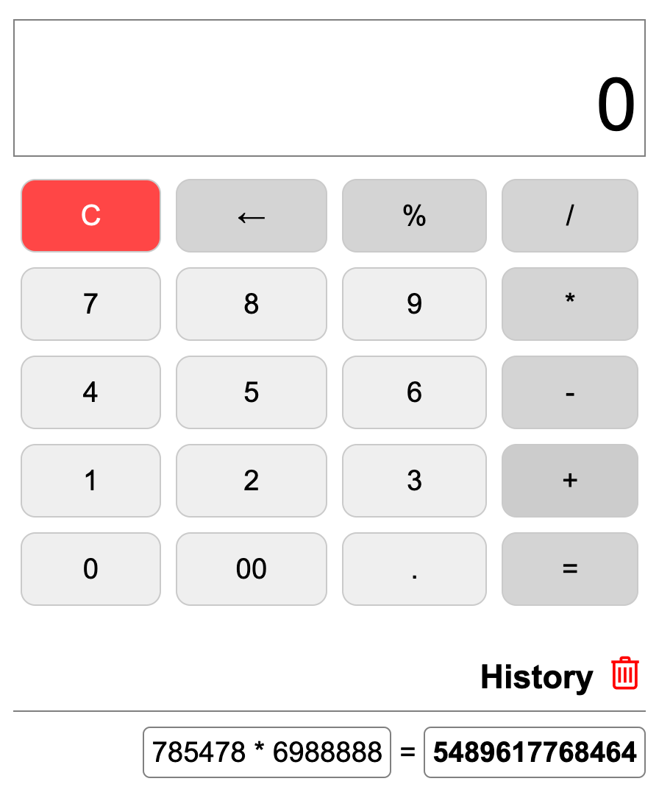

# Calculator

## Brief
It is an open source calculator based on HTML5/Javascript/CSS/jQuery. It uses [mathjs.org](https://mathjs.org/) library to evaluate mathematical expressions.

Report an issue [here](https://github.com/pratikabu/calculator/issues).

Access the calculator on [calculator.pratikabu.com](https://calculator.pratikabu.com).

## Mission
To provide an ad free, simple calculator, that actually works.

## Unique Features
- History Persistence
- Responsive UI

## Future Path
- Expert Expression Mode
- Theming
- Tagging history expressions
- Browser Extension
- Number format localization

## Credits
- [mathjs.org](https://mathjs.org/) library
- [jQuery](https://jquery.com/)
- JetBrains [WebStorm](https://www.jetbrains.com/webstorm/)
- App icon: [IconFinder](https://www.iconfinder.com/icons/1055102/calculation_calculator_math_mathematics_icon)

## Support
- Spread the word by sharing [this](https://calculator.pratikabu.com) website.
- Support development by [Donating](https://scrolltotop.pratikabu.com/donate).
- Support in the development.

Read more about the [author](https://pratikabu.com).
